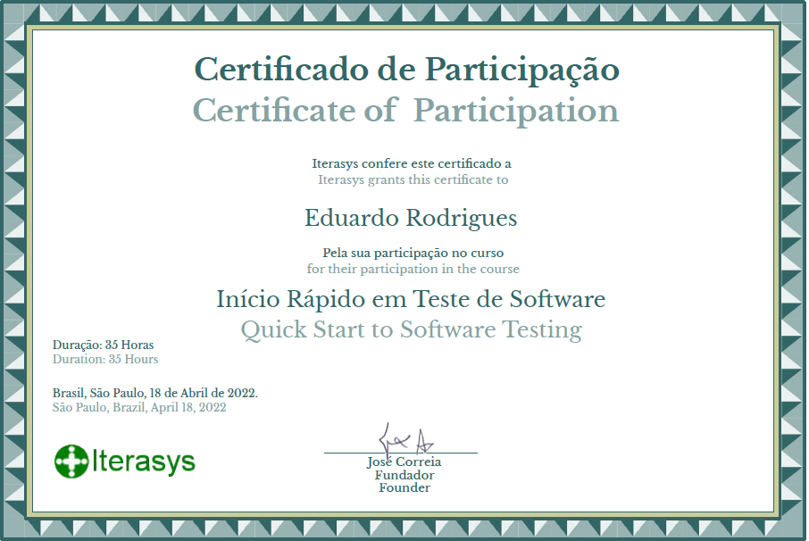

# Iterasys - Curso de Teste de Software

[](https://github.com/eduardodsr/testeDeSoftware)


## Iterasys - Início Rápido em Teste de Software

<h1 align="center"> Teste de Software </h1>

<p align="center"> |&nbsp;&nbsp;&nbsp; 
  <a href="#m1">01. Apresentação</a>&nbsp;&nbsp;&nbsp;|&nbsp;&nbsp;&nbsp;
  <a href="#m2">02. Introdução ao Teste de SW</a>&nbsp;&nbsp;&nbsp;|&nbsp;&nbsp;&nbsp;
  <a href="#m3">03. Atitudes de um QA</a>&nbsp;&nbsp;&nbsp;|&nbsp;&nbsp;&nbsp;
  <a href="#m4">04. Planejamento de Testes  </a>&nbsp;&nbsp;&nbsp;|&nbsp;&nbsp;&nbsp;
  <a href="#m5">05. Testes Web &nbsp;&nbsp;&nbsp;|&nbsp;&nbsp;&nbsp;
   <a href="#autor">Autor &rarr; eduardodsr</a>&nbsp;&nbsp;&nbsp;|&nbsp;&nbsp;&nbsp;
</p>

<hr>

### Objetivo

- Introduzir e atualizar profissionais em Teste de Software e sua Automação
- 5 Módulos
- 60h
- Concluído em 18/04/2022

<hr>

### Módulos

| Tópicos                                             | Concluído |
| --------------------------------------------------- | --------- |
| Módulo 1 - Apresentação do Curso                    | 100%      |
| Módulo 2 - Introdução ao Teste de Software          | 100%      |
| Módulo 3 - Atitudes de um Profissional da Qualidade | 100%      |
| Módulo 4 - Planejamento de Testes                   | 100%      |
| Módulo 5 - Testes Web                               | 100%      |

<hr>

### Certificado de Conclusão de Eduardo Rodrigues

<br>

<a href="./certificado/EduardoRodriguesCertificado.pdf" target="_blank"> 
    
</a>

&nbsp;&nbsp;&nbsp;

<hr>

<span id="m1">

### Módulo 1 - Apresentação do Curso

Professor: José Correia

- [x] 1. Quem é a Iterasys
- [x] 2. Quem é o José Correia
- [x] 3. A carreira em Teste e QA
- [x] 4. Por que o próprio Dev não testa?
- [x] 5. Habilidades Pessoais do Testador/QA
- [x] 6. Habilidades Interpessoais do Testador/QA
- [x] 7. Trabalho em Equipe
- [x] 8. Hard Skills & Soft Skills
  - **Soft Skills** são as habilidades comportamentais;
  - **Hard Skills** representam as habilidades técnicas intrinsicamente necessárias a realização do trabalho.
  - Um **Profissional de Testes/QA** precisa de um conjunto de conhecimentos e habilidades pertencentes a diversos dominios, de tecnologia ao negócio, do geral ao específico da área da Qualidade de Software.
- [x] 9. Débito Técnico
  - [Débito Técnico] &rarr; Todos nós precisamos desenvolver vários conhecimentos e habilidades que ainda nos faltam;  
    Contudo a velocidade dos projetos e a concorrência entre empresas ou profissionais requer o bom senso de não acumular dívidas exageradas;
    É mais fácil manter-se sempre aprendendo do que ter que reinventar após anos afastado dos estudos e inovações.
- [x] 10. Os Diferentes Objetivos deste Curso
- [x] 11. Como Estudar e Progredir
- [x] 12. Crie o seu Cartão de Visita Digital
- [x] 13. Conecte-se
- [x] 14. Redes Sociais, Grupos e Canais da Iterasys
- [x] 15. Um Mapa para o Futuro
- [x] 16. Simulado do Módulo 01
- [x] 17. Avaliação - Prova do Módulo 01

<br>

<hr>

<span id="m2">

### Módulo 2 - Introdução ao Teste de Software

Professor: José Correia

- [x] 1. Uma Breve História do Teste
- [x] 2. Importância do Teste X Danos dos Bugs
- [x] 3. Os 7 Fundamentos do Teste (ISTQB)
- [x] 4. Teste Demonstra a Presença de Defeitos, Mas Nunca a Sua Ausência (1Fund)
- [x] 5. Teste Exaustivo Não É Possível (2Fund)
- [x] 6. Teste Antecipado (3Fund)
- [x] 7. Agrupamento de Defeitos (4Fund)
- [x] 8. Paradoxo do Pesticida (5Fund)
- [x] 9. Teste Depende de Contexto (6Fund)
- [x] 10. A Ilusão da Ausência de Erros (7Fund)
- [x] 11. Diferença entre Teste e QA
- [x] 12. Erro, Ocorrência, Defeito e Falha
- [x] 13. Tipos de Testes Baseados na IEC/ISO 25010

<br>

- Acrônimo (Sigla criada por mim): **AF UCC ED MPS**

| AF UCC ED MPS | Tipos de Testes          |
| ------------- | ------------------------ |
| **AF**        | Adequação Funcional      |
| **U**         | Usabilidade              |
| **C**         | Compatibilidade          |
| **C**         | Confiança                |
| **ED**        | Eficiência no Desempenho |
| **M**         | Manutenibilidade         |
| **P**         | Portabilidade            |
| **S**         | Segurança                |

<br>

- [x] 13. Tipos de Testes Baseados na IEC/ISO 25010
  - **AF UCC ED MPS**
- [x] 14. IEC/ISO 25010
  - **AF** - Adequação Funcional (Funcionalidade)
  - Software atinge os resultados apropriados de forma correta.
- [x] 15. IEC/ISO 25010
  - **U** - Usabilidade
  - Facilitar a utilização (navegação) do software
  - **Acessibilidade** - Facilitar o acesso a todas as pessoas
- [x] 16. IEC/ISO 25010
  - **C** - Compatibilidade
- [x] 17. IEC/ISO 25010
  - **C** - Confiança
- [x] 18. IEC/ISO 25010
  - **ED** - Eficiência no Desempenho
- [x] 19. IEC/ISO 25010
  - **M** - Manutenibilidade
  - Ao receber uma demanda de Testar um Software.
  - Primeiro, você deve avaliar a **Testabilidade do Software**.
  - Tenho as informaçoes, recursos, conhecimento, ferramentas necessárias para fazer o Teste de Software.
- [x] 20. IEC/ISO 25010
  - **P** - Portabilidade
- [x] 21. IEC/ISO 25010
  - **S** - Segurança
- [x] 22. Testes Manuais X Testes Automatizados
- [x] 23. Testes Tradicionais X Testes Ágeis
- [x] 24. QArentena 18 - Os Piores Bugs da História
- [x] 25. Simulado do Módulo 2
- [x] 26. Avaliação - Prova do Módulo 2

<br>

---

<b><u> Módulo 2 - Resumo das minhas anotações: </b></u>

#### Aula 3 - Os 7 Fundamentos (Princípios) do Teste (ISTQB)

### 1 - Teste demonstra a presença de defeitos;

Reduz a probabilidade de permanência dos defeitos no software, mas não garante que o software esteja totalmente livre de defeitos.

### 2 - Teste exaustivo é impossível;

É necessário verificar os “riscos e prioridades” para focar aos esforços de testes nas principais expectativas e necessidades do software, já que testar “tudo” é praticamente impossível.

### 3 - Teste antecipado;

Deve começar no início do desenvolvimento, com atividades de planejamento, análise e modelagens contendo objetivos bem definidos.

### 4 - Agrupamento de defeitos;

Segue a definição do Princípio de Pareto: Um número pequeno de módulos (20%) contém a maioria dos defeitos descobertos (80%).

### 5 - Paradoxo do Pesticida;

Após determinado tempo, os testes que não identificam mais defeitos, precisam ser revisados e atualizados para testar outros pontos do sistema com objetivo de aumentar a possibilidade de encontrar mais erros.

### 6 - Teste depende do contexto;

Cada contexto exige que a aplicação de testes seja diferente. Não é possível aplicar o mesmo teste de um sistema de segurança em um sistema de e-commerce.

### 7 - A ilusão da ausência de erros.

Encontrar e consertar defeitos não ajuda se o sistema construído não atende às expectativas e necessidades dos usuários.

Fonte: Certified Tester Foundation Level Syllabus, disponível em:
http://www.bstqb.org.br/

---

## Os 7 Princípios do Teste de Software

**1. Testes mostram a presença de erros.**
Testes objetivam a detecção de defeitos dentro de um pedaço do software. Mas não importa quanto um produto é exaustivamente testado, nunca é possível afirmar 100% que um produto não tem falhas. Apenas Podemos usar os testes para reduzir o número de defeitos não encontrados.

**2. Testes Exaustivos são impossíveis.**
Não é possível testar todas as combinações de inputs de dados, cenários e pré-condições dentro de uma aplicação. Por exemplo, se uma única tela de aplicação contém 10 campos para acrescentar dados com 3 possíveis opções de valores cada, isto significa que para cobrir todas possíveis combinações, engenheiros de teste deveriam criar 59,049 (310) cenários de teste. E se a Aplicação contiver 50 ou mais de tais telas? Ao invés de gastar semanas criando milhões de tais cenários, é melhor focar naqueles potencialmente mais significativos.

**3. Teste Cedo/Antes.**
O custo de um erro cresce exponencialmente ao longo do processo de Desenvolvimento, portanto é importante começar a testar o quanto antes, para que o defeito seja resolvido.

**4. Aglutinação de Defeitos.**
Este princípio é frequentemente referido como uma aplicação do princípio de Pareto no Teste de Software. Isto significa que aproximadamente **80% dos erros** são usualmente encontrados em **20% dos módulos do sistema**. Assim, se um defeito é encontrado em um modulo particular do programa de software, as chances de haver outros defeitos são grandes. E por isso é que faz sentido testar esta área do produto exaustivamente.

**5. Paradoxo Pesticida.**  
Rodar o mesmo conjunto de testes de novo e de novo não te achará a encontrar mais falhas. Assim que os defeitos detectados são corrigidos, estes cenários de teste se tornam inúteis. Assim, é importante revisar e atualizar regularmente os testes para adaptá-los e potencialmente encontrar mais falhas.

**6. Teste depende do contexto.**
Dependendo do proposito ou da indústria, diferentes aplicações devem ser testadas diferentemente. Enquanto a segurança pode ser de importância primária para um produto de tecnologia financeira, é menos importante para um website corporativo. Este ultimo põe ênfase em usabilidade e velocidade.

**7. Falácia da Ausência de erros.**  
A completa ausência de defeitos no seu produto não significa necessariamente que ele será um sucesso. Não importa o tempo que você dedique melhorando as funcionalidades se seu produto não é útil ou atende as expectativas dos usuários, ele não será adotado pela audiência alvo.

Enquanto a lista de princípios acima é um guia indiscutível para qualquer profissional de testes, existem mais aspectos à serem considerados. Algumas fontes adicionam outros princípios à estes princípios básicos:

- Teste deve ser processo independente gerido por profissionais imparciais.
- Teste para valores inválidos e inesperados tanto quanto para valores esperados e válidos.
- Testes devem ser feitos apenas em partes estáticas do software (mudanças não devem ser feitas durante o processo de testes).
- Use documentação exaustiva e compreensiva para definir os resultados esperados.

#### Aula 11. Diferença entre Teste e QA

- **Tester (Teste/Testador)** - foco no produto
- **QA (Quality Analyst, Analista de Qualidade)** - foco no processo

- O **QA**, tende a ter um olhar macro sobre os processos, uma visão sistêmica, não só para o desenvolvimento de um software especifico e sim por todo os processos realizados a fim de otimizar o desenvolvimento da equipe, desde o planejamento até a entrega para o cliente.

  - Ex: O **QA**, participa de várias reuniões em todos os times, principalmente das de planejamento e de retrospectiva. Ele é um sujeito otimista que está sempre procurando como melhorar a forma de trabalharmos

- O **Tester**, tende a ter um olhar mais especifico no projeto, a fim de encontrar os erros que comprometam a experiência do cliente, ele tem que saber muito bem qual é a necessidade do cliente e verificar se o software atende as expectativas proposta!
  - \*Ex: O **Tester** sempre preocupada com a qualidade do software que estamos construindo. Ela discute critérios de aceitação, realiza testes manuais e automatizados e costuma ser muito participativa em todas as reuniões, nos lembrando que juntos construimos um software melhor.

#### Aula 12. Erro, Ocorrência, Defeito e Falha

<p align="center">
  
 </p>

#### Aula 13 - Tipos de Testes Baseados na IEC/ISO 25010

- Conhecida como **SQuaRE** - Systems and Software Quality Requeriments and Evaluation (Requerimento e Avaliação da Qualidade de Sistemas e Software)

- **Qualidade de Produto e Software** - IEC/ISO 25010 - **AF UCC ED MPS**
  - AF (Adequação Funcional)
  - UCC (Usabilidade, Compatibilidade e Confiança)
  - ED (Eficiência no Desempenho)
  - MPS (Manutenibilidade, Portabilidade, Segurança)
    <p align="center">
        
    </p>

<br>

<hr>

<span id="m3">

### Módulo 3 - Atitudes de um Profissional da Qualidade

Professor: José Correia

- [x] 1. [Live 01] O Mindset Correto
- [x] 2. [Live 02] Valores e Princípios Ágeis
- [x] 3. [QArentena 16] Scrum - com Fernando Ruano
- [x] 4. Pressão Organizacional
- [x] 5. Comprometido X Envolvido
- [x] 6. Autogerenciamento
- [x] 7. Comunicação Verbal e Não Verbal
- [x] 8. Negociação (Ganha-Ganha)
- [x] 9. Produtividade - Parte 1
- [x] 10. Produtividade - Parte 2
- [x] 11. Fluxo Contínuo - Parte 1
- [x] 12. Fluxo Contínuo - Parte 2
- [x] 13. Técnica Pomodoro

<br>
<hr>

<span id="m4">

### Módulo 4 - Planejamento de Testes

Professor: José Correia

- [x] 1. [Live03] Planejamento de Testes
- [x] 2. Negociando um acordo flexível e de valor
- [x] 3. Plano de Teste
- [x] 4. Mapa Mental como alternativa no planejamento
- [x] 5. Requisitos Funcionais e Não Funcionais
- [x] 6. Estórias dos Usuários
- [x] 7. Pre-Game
- [x] 8. Product Backlog
- [x] 9. Sprint
  - **Sprint** ou iteração - é um ciclo em que se decide o que será construído, se constrói, testa e disponibiliza uma parte útil e valiosa de um software
- [x] 10. Sprint Backlog
  - **Sprint Backlog** - o que vamos realizar neste ciclo:
    - Novas Estórias
    - Mudanças
    - Correções
- [x] 11. Épicos
  - **Épicos** - Conjuntos de Estórias e/ou Funcionalidades que formam uma grande entrega.
  - Organizar as estórias e funcionalidades embaixo de um épico pode ser útil para: Enxergar as partes do software que formarão uma grande entrega
- [x] 12. Features (Funcionalidades)
  - **Features** - Funcionalidades - Algo de valor percebido pelo cliente. Uma **feature** é uma funcionalidade do sistema que entrega um benefício ou resolve um problema real do cliente, geralmente representada através de User Stories nos métodos ágeis.
  - **Features** são funcionalidades ou recursos tem como propósito adicionar uma nova entrega de valor e experiência para seus usuários.
- [x] 13. Análise de Riscos
  - **Análise de riscos** - deve ocorrer durante o planejamento de um produto ou iteração. Durante essa etapa os riscos serão identificados e priorizados, mas devem ser avaliados periodicamente.
  - **Análise de riscos** - é o processo de identificação e análise de possíveis problemas que podem impactar negativamente o negócio. Seu principal objetivo é ajudar as organizações e evitar ou mitigar os riscos.
- [x] 14. Matriz de Risco
  - **Matriz de Risco** - Objetivo de exibir as chances de riscos acontecerem, traçando de certa maneira uma probabilidade em cada risco.
- [x] 15. Os Riscos Estão Vivos - Comercial Allianz Seguros: Probabilidades
- [x] 16. Planning Poker
  - **Planning Poker e Pontuação de Fibonacci**
- [x] 17. Histórico dos Riscos
  - **Histórico dos Riscos** - Ajuda a tormar boas decisões.
- [x] 18. Análise de Pareto
  - **Análise de Pareto** - Também conhecida como **Regra 80/20**, **Curva ABC** ou, ainda, **Diagrama de Pareto**.
  - A **Análise de Pareto** é um esquema, geralmente em forma de gráfico de colunas, que agrupa e ordena a frequência de determinadas ocorrências. Tudo é feito com base em uma ideia bem simples: de que 80% das consequências advêm de 20% das causas.
- [x] 19. Priorização por Impulso
  - **Priorização por Impulso** - Analise do **Diagrama de Pareto** - Seguir a ordem do maior para menor.
- [x] 20. Priorização por Atração
  - **Priorização por Atração** - Um item priorizado atrai itens menores priorizados que podem ser resolvidos juntos.
- [x] 21. Análise da Cauda Longa
  - **Análise da Cauda Longa** - Cauda longa se refere a uma estratégia que busca atingir várias coisas com baixa procura, em vez de focar em poucas coisas e com muitos pedidos. No varejo, geralmente, os produtos que estão na cauda longa são mais rentáveis no acumulado.
  - Representada por um **gráfico de curva**, a teoria explica a estratégia de direcionar ações para coisas que têm pouca demanda ao invés daquelas que têm muita procura. Quando aplicada ao varejo, a cauda longa mostra que poucos produtos de nicho geram tanta receita quanto poucos produtos de muito sucesso.
- [x] 22. Exemplo de Uso de Pairwise na Cauda Longa (PICT Online)
  - **Pairwise Testing** ou **Testes de Pares** - Geração Combinatória de Casos de Teste. O teste de pares é uma técnica eficaz de geração de casos de teste que se baseia na observação de que a maioria das falhas é causada por interações de no máximo dois fatores. Os conjuntos de testes gerados por pares cobrem todas as combinações de dois, portanto, são muito menores do que os exaustivos, mas ainda assim muito eficazes na localização de defeitos.
    `Link: https://www.pairwise.org/`
  - **Pairwise Available Tools** - **Combinatorial Test Case Generation** (ou Ferramentas de Testes de Pares - Geração Combinatória de Casos de Teste) - Realizar uma amostragem (amostragem utilizada por combinação de conjuntos, é matemática, não é sorteio). A técnica de Pairwise é muito utilizada por grandes empresas.
    `Link: https://www.pairwise.org/tools.html `
- [x] 23. Simulado
- [x] 24. Avaliação - Planejamento de Testes

---

<b><u> Módulo 4 - Resumo das minhas anotações: </b></u>

#### Aula 05 - Requisitos Funcionais e Requisitos Não Funcionais

- A diferença entre **Requisitos Funcionais e Requisitos Não Funcionais** é muito simples. Tudo o que diz respeito ao comportamento de um sistema que atenderá o processo do negócio do cliente são **REQUISITOS FUNCIONAIS**.
- E tudo o que diz respeito às características gerais de um sistema, como custo, confiabilidade, desempenho, usabilidade, segurança, disponibilidade, manutenção e tecnologias envolvidas, são **REQUISITOS NÃO FUNCIONAIS**.

#### Aula 13. Análise de Riscos

- **A importância da análise de riscos**

Qualquer ação humana está sujeita a riscos. Se você sai na rua, está sujeito ao risco de sofrer um acidente ou um ato de violência, certo? Porém, sabendo disso, você toma medidas para reduzir essas ameaças — como andar com mais atenção, fechar o vidro do carro nos semáforos e não carregar muito dinheiro na carteira.

Em um contexto empresarial, a realidade é muito similar, pois qualquer decisão ou atividade traz um risco.

Por isso, antes de agir, é preciso analisar quais são as ameaças prováveis e traçar estratégias para reduzir a possibilidade de que elas ocorram — além de determinar medidas para lidar com o pior cenário.

Essas estratégias e medidas podem livrar o negócio de grandes problemas, como perdas financeiras ou o enfraquecimento da marca. Ou seja, dedicando um pouco mais de tempo à fase de planejamento, você pode evitar muitas dores de cabeça no futuro.

#### Como fazer uma análise de riscos?

- **1. Determine a situação a ser analisada**

- **2. Defina os possíveis resultados negativos da situação elencada**

- **3. Estipule o grau de cada risco**

- **4. Defina suas estratégias**

- 4.1. Aceitar riscos
- 4.2. Evitar riscos
- 4.3. Transferir riscos
- 4.4. Mitigar riscos
- 4.5. Explorar riscos

#### EX. ANALISE DE RISCOS (Exemplo criado por mim)

- Legenda da Tabela
  - **C - CONSEQUENCIA** - são os impactos mais prováveis caso o risco venha a se concretizar.
  - **E - EXPOSIÇÃO AO RISCO** - é a freqüência que este risco costuma manifestar-se na organização ou atividade avaliada.
  - **P - PROBABILIDADE** - é a real chance do risco vir a acontecer, dentro de uma escala de possibilidades.
  - **GC - GRAU DE CRITICIDADE** - Cada risco deverá ser pontuado de acordo com suas características nos três fatores da formula do Grau de Criticidade.
    - GC = ( C x E x P )

| Nº  | NOME DO RISCO        | C   | E   | P   | GC = (CxExP) | ESTRATEGIA        | AÇÕES A TOMAR     | COMO?      | RESPONSAVEL | REAVALIDAR |
| --- | -------------------- | --- | --- | --- | ------------ | ----------------- | ----------------- | ---------- | ----------- | ---------- |
| 1   | FALHA                | 10  | 10  | 10  | 1.000        | MITIGAR RISCOS    | CORREÇÃO IMEDIATA | TESTAR     | QA          | DIÁRIO     |
| 2   | TROCA DE PEDIDOS     | 5   | 5   | 5   | 125          | TRANSFERIR RISCOS | CORREÇÃO URGENTE  | MONITORAR  | EQUIPE      | DIÁRIO     |
| 3   | TROCA DE PROGRAMADOR | 1   | 2   | 2   | 4            | ACEITAR RISCOS    | ELIMINAR RISCO    | MONITORAR  | GERENTE     | SEMANAL    |
| 4   | PAGAMENTO FORA DO AR | 1   | 1   | 2   | 2            | EVITAR RISCOS     | ELIMINAR RISCO    | RELATORIOS | LIDER       | SEMANAL    |

- OBS: A tabela foi criada por mim!

<br>

#### Aula 14. Matriz de Risco

- **Matriz de Risco** - Objetivo de exibir as chances de riscos acontecerem, traçando de certa maneira uma probabilidade em cada risco.
- Através de uma **Matriz de Risco** é possível identificar a magnitude do risco e dimensionar as devidas ações para controle do mesmo. De maneira gráfica, como geralmente é feita, facilita o trabalho de acompanhar processos e desenvolver projetos de segurança, priorizando e mapeando tarefas e ações que merecem destaque. Além disso, ajuda bastante quando a empresa trabalha com equipes, pois é mais fácil de seguir as ações e acompanhar o trabalho.

<br>

<hr>

<span id="m5">

### Módulo 5 - Testes Web

Professor: Marcelo de Bittencourt

- [x] 1. Tipos de Aplicações Web
  - **Tipos de Aplicações Web**
  - Além de uma fácil navegação, desempenho, acessibilidade e responsividade são algumas das características a serem avaliadas durante os testes de uma aplicação Web.
  - E vários testes adicionais podem enriquecer a qualidade e relevância do site, como avaliar a **otimização para mecanismos de busca (SEO)** ou mesmo quais são as regiões das páginas, elementos, informações e produtos que chamam mais a atenção através de um **mapa de calor (heat map)**.
  - **OBS:**
    - Performace - Se um site demora carregar +10s - perde 80% do público
  - **Ferramentas:**
    - **Google Analytics** - O Analytics é capaz de identificar além da tradicional taxa de exibição e hit de uma página, localização geográfica do visitante, forma com a qual chegou na página (através de links de outros sites, buscador, AdSense ou diretamente pelo endereço), sistema operacional, navegador, navegador e sistema operacional.
      - Link: `https://rockcontent.com/br/blog/google-analytics/`
    - **Crazy Egg** - Website Optimization | Heatmaps & A/B Testing
      - Heatmaps (Mapa de Calor)
      - A/B Testing (Teste A/B)
    - **SEO Site Checkup**: SEO Tools, Software and Articles
      - Link: `https://seositecheckup.com/`
- [x] 2. Obama e o Teste A/B
  - **Test A/B Obama** - O partido democrata fez um investimento milionário para otimizar o site da campanha eleitoral para o segundo mandato do presidente Obama.
  - Vamos usar esse caso como um rápido exemplo de como podemos testar e melhorar a experiência dos usuários, aprendendo com quais elementos, cores, tamanhos, conteúdos e diagramações fazem mais sentido para o nosso público.
- [x] 3. Planejamento e Análise para Testes Web
  - **Testes funcionais**
    - Análise de riscos
      - Prioridades
    - Restrições de projeto
      - Tempo
      - Tamanho da equipe
    - Cenários
      - Validações básicas
      - Fluxo padrão
      - Funcionalidades adicionais
  - **Testes não funcionais**
    - Desempenho
    - Segurança
    - Acessibilidade

* **E-Commerce**

  - PrestaShop live demo - Multi-devices support
  - Links:

  * https://marcelodebittencourt.com/demoprestashop

  * https://github.com/PrestaShopCorp/live-demo-devices

  * https://demo.prestashop.com

<br>
   
* **Projeto de Planejamento e Analise de Testes:**                    
    Prioridade| Fluxo  | Cenários
    --------- | ------ | ------
    1 | Validações básicas | Lista de produtos na página principal
    2 | Validações básicas | Validar carrinho vazio
    3 | Fluxo padrão | Compra de um novo produto
    4 | Fluxo padrão | Procura de produto
    5 | Validações adicionais | Contate-nos
    6 | Validações adicionais | Links do rodapé

- [x] 4. O que é Java
- [x] 5. Instalar o Java (Open JDK)

     - O **Open JDK** reune os recursos do Java necessários para realizarmos a automação, e é pré-requisito para um projeto com **Selenium WebDriver** com base nessa linguagem. Pode também ser utilizado o Oracle JDK. Fique atento a questões de licenciamento em sua empresa.

     - O Open JDK é o open source e gratuíto.
     - `Link:` https://jdk.java.net/

- [x] 6. O que é o Eclipse IDE

  - Verificar se o Java foi instalado.
  - `Terminal (Prompt de comando):` _java -version_

- [x] 7. Instalar o Eclipse IDE

  - Uma das interfaces de desenvolvimento mais utilizadas para programação em Java é o **Eclipse**, ao lado de alternativas de peso como NetBeans (Oracle) e IntelliJ (JetBrains) .
  - `Link:` https://www.eclipse.org/downloads/

- [x] 8. Instalar o Chrome Browser
- [x] 9. Instalar o Chrome Driver

  - A comunicação entre o **Selenium** e o **browser** será feita através de um conector, um tradutor de comandos, que chamamos de **driver**. Para cada versão ou conjunto de versões de cada browser haverá um driver especifico.

  - Isso lembra a necessidade que temos de instalar um driver para um impressora que desejamos usar em casa ou no escritório.

  - O **Chrome Driver** é um dos poucos cujo número da versão do driver coincide com o número da versão do browser. Embora seja algo simples e útil, nem todas outras empresas tiveram a mesma preocupação de organização quanto o Google.

  - `Link`: https://chromedriver.chromium.org/downloads

  - `Exemplo`:
  - Chrome version **94** >>> ChromeDriver **94**.0.4606.61
  - Chrome version **98** >>> ChromeDriver **98**.0.4758.80

- [x] 10. Criação de um Script de Teste com **Maven** e **Selenium**

<!--
  - Testes:

    - https://marcelodebittencourt.com/demoprestashop

  - Instalar as **depedencias** do projeto de **E-commerce**

    - junit-jupiter
      https://mvnrepository.com/artifact/org.junit.jupiter/junit-jupiter
    - hamcrest
      https://mvnrepository.com/artifact/org.hamcrest/hamcrest/2.2
    - selenium-java
      https://mvnrepository.com/artifact/org.seleniumhq.selenium/selenium-java

  - Criar os testes dentro da pasta **src/test/java**

    - New Package Java -> homepage
    - homepage -> New Class

  - <code> HomePageTests.java </code>

  ```java
  // HomePageTests.java
  package homepage;

  import static org.hamcrest.MatcherAssert.assertThat;
  import static org.hamcrest.Matchers.is;

  import org.junit.jupiter.api.Test;
  import base.BaseTests;

  public class HomePageTests extends BaseTests {
      @Test
      public void testContarProdutos_oitoProdutosDiferentes() {
          carregarPaginaInicial();
          assertThat(homePage.contarProdutos(), is(8));
      }
  }
  ```

  - <code> BaseTests.java </code>

  ```java
  // BaseTests.java
  package base;

  import org.junit.jupiter.api.AfterAll;
  // < command > + < shift > + < o > // importar todas as bibliotecas
  import org.junit.jupiter.api.BeforeAll;
  import org.junit.jupiter.api.BeforeEach;
  import org.openqa.selenium.WebDriver;
  import org.openqa.selenium.chrome.ChromeDriver;

  import pages.HomePage;

  public class BaseTests {

      private static WebDriver driver;
      protected HomePage homePage;

      @BeforeAll
      public static void inicializar() {
          System.setProperty("webdriver.chrome.driver", "/Users/eduardo/Downloads/ChromeDriver-version-94/chromedriver");
          driver = new ChromeDriver();
      }

      @BeforeEach
      public void carregarPaginaInicial() {
          driver.get("https://marcelodebittencourt.com/demoprestashop/");
          homePage = new HomePage(driver);
      }

      @AfterAll
      public static void finalizar() {
          driver.quit();
      }
  }
  ```

  - <code> HomePage.java</code>

  ```java
  // HomePage.java
  package pages;

  import java.util.ArrayList;
  import java.util.List;

  import org.openqa.selenium.By;
  import org.openqa.selenium.WebDriver;
  import org.openqa.selenium.WebElement;

  public class HomePage {

      private WebDriver driver;

      List<WebElement> listaProdutos= new ArrayList<WebElement>();

      private By produtos = By.className("product-description");

      public HomePage(WebDriver driver) {
          this.driver = driver;
      }

      public int contarProdutos() {
          carregarListaProdutos();
          return listaProdutos.size();
      }

      private void carregarListaProdutos() {
          listaProdutos = driver.findElements(produtos);
      }
  }
  ```

  - Resultado Teste da HomePage
   <p align="center">
      
  </p>

  -->

- [x] 11. Confirmar que o Carrinho de Compras está Vazio
- [x] 12. Testar o Fluxo Padrão - Parte 1
- [x] 13. Testar Login
- [x] 14. Testar o Fluxo Padrão - Parte 2
- [x] 15. Testar o Fluxo Padrão - Parte 3
- [x] 16. Teste do Fluxo Padrão - Parte 4
- [x] 17. Testar o Fluxo Padrão - Parte 5
- [x] 18. Testar o Fluxo Padrão - Parte 6
- [x] 19. Testar o Fluxo Padrão - Parte 7
- [x] 20. Testar Ir para o Carrinho - Parte 1
- [x] 21. Testar Ir para o Carrinho - Parte 2
- [x] 22. Testar Ir para o Carrinho - Parte 3
- [x] 23. Testar Ir para o Carrinho - Parte 4
- [x] 24. Testar Ir para o Carrinho - Parte 5
- [x] 25. Ir Para Check Out - Parte 1
- [x] 26. Ir Para Check Out - Parte 2
- [x] 27. Ir Para Check Out - Parte 3
- [x] 28. Finalizar Pedido - Parte 1
- [x] 29. Finalizar Pedido - Parte 2
- [x] 30. Solução de Problemas: Sincronismo
- [x] 31. Solução de Problemas - Programação Exótica
- [x] 32. Uso de Massa em Testes Web
- [x] 33. Evidência e Registro de Defeitos em Testes Web
- [x] 34. Cucumber: Definição e Ambiente
- [x] 35. Cucumber: Visualizar Produto
- [x] 36. Cucumber: Massa
- [x] 37. Cucumber: Evidências
- [x] 38. Cucumber: Relatórios
- [x] 39. QArentena - 20 - Localizando Elementos via CSS e XPath - com Danilo Freitas
- [x] 40. Simulado 1 - Testes Web - Instalação e Configuração
- [x] 41. Simulado 2 - Testes Web
- [x] 43. Avaliação - Testes Web Marcelo de Bittencourt

<br>

---

<b><u> Módulo 5 - Resumo das minhas anotações: </b></u>

#### Pirâmide de Testes – Porque você precisa saber

<p align="center">
    
</p>

#### O que é a Pirâmide de testes?

A pirâmide de testes é uma ilustração que permite visualizar de forma simples os tipos de testes, seus níveis, velocidades, complexidades e “custos”.

Além disso ela busca dar um direcionamento em relação a quantidade de testes a ser implementados em cada nível.

Além do direcionamento em relação a quantidade também apresenta uma visão acerca da velocidade da execução dos testes (e da sua criação também) e também do nível de isolamento do testes.

A pirâmide apresenta 3 níveis, são eles:

- **Base** – Testes unitários (**Unit**)
- **Meio** – Testes de integração (**Service/Integration**)
- **Topo** – Testes ponta a ponta (E2E) (**UI - User Interface**)

Então vamos ver cada um dos níveis da pirâmide.

<br>

#### Base – Testes Unitários

Os testes unitários são os testes da menor parte testável de uma aplicação.

A menor parte testável de uma aplicação é um método público em uma classe (falando em orientação a objetos) ou uma função.

Os testes unitários é que eles são extremamente pequenos e rápidos.

Já que se referem a uma parte especifica da aplicação.

Além disso os testes são totalmente independentes.

Não tendo assim nenhum vínculo com outras partes da aplicação

Outra vantagem é que caso um teste unitário falhe é fácil descobrir o problema, já que o teste cobre um escopo de unidade do código.

Além disso outro ponto sobre os testes unitários é que eles podem guiar o desenvolvimento de todo o seu sistema

Usando o desenvolvimento orientado a testes (TDD).

<br>

#### Meio – Testes de Integração

O teste de integração busca testar como diferentes módulos (ou unidades) do sistema interagem entre si.

Diferente dos testes unitários os testes de integração dependem de componentes externos para serem criados e executados.

Alguns casos comuns de cobertura de testes de integração são por exemplo.

- Comunicação com bancos de dados
- Comunicação entre micro serviços

Por usarem elementos externos os testes de integração precisam de maior infraestrutura para serem criados e executados.

Muitas vezes os testes de integração demandam um ambiente completo.

Ambiente esse criado para testes de integração e testes ponta a ponta na maior parte dos casos.

<br>

#### Topo – Testes ponta a ponta (E2E)

Os testes ponta a ponta (E2E) buscam testar todo um fluxo de funcionamento da aplicação.

Nesse caso a ideia é realmente validar todo o funcionamento de fluxos que o usuário mais faz.

Além disso muitas vezes os testes ponta a ponta são um bom termômetro da saúde da aplicação.

Pois eles testam a aplicação como um todo.

Mas o tempo de desenvolvimento e de execução de testes ponta a ponta é muito grande.

Levando assim a terem poucos testes de ponta a ponta, cobrindo só os casos principais na maior parte dos casos.

<br>

#### Pirâmide de Testes – Conclusão

Voltando a pirâmide de testes em si, devemos lembrar que a base da pirâmide é mais simples de criar e mais rápida de rodar.

Já o topo da pirâmide é mais complexa de se criar e muito mais demorada de se rodar.

Então a maior parte dos testes deve estar na base da pirâmide, já no topo devemos ter só os fluxos principais.

Já os testes de integração devem ser usados para fluxos onde o teste ponta a ponta não cobre mas que os testes unitários não conseguem cobrir como um todo.

---

#### Tipos de testes de software: diferenças e exemplos

O **teste de software** é parte integrante do ciclo de vida de desenvolvimento de software (SDLC). Testar é como você pode ter certeza sobre funcionalidade, desempenho e experiência do usuário. Se você realizar seus testes manualmente ou via automação, quanto mais cedo e mais frequentemente você puder realizar testes, mais provável é que você identifique bugs e erros, não apenas salvando você e sua equipe de possíveis perfurações de incêndio mais tarde, mas também garantindo que seu aplicativo de software tenha sido cuidadosamente revisado e auditado antes que ele esteja na frente de seus usuários. Se os problemas passarem para o ambiente de produção, mais caros e demorados serão para corrigir.

Os **testes de software** podem ser divididos em dois tipos diferentes: **testes funcionais** e **não funcionais**. Diferentes aspectos de um aplicativo de software exigem diferentes tipos de testes, como testes de desempenho, testes de escalabilidade, testes de integração, testes de unidade e muito mais. Cada um desses tipos de testes de software oferece excelente visibilidade em seu aplicativo, desde o código até a experiência do usuário. Vamos entrar nos detalhes de alguns dos tipos mais comuns de testes de software.

---

#### Tipos de testes de software: Testes funcionais e não funcionais

<br>

<p align="center">
        
</p>

<br>
 
### Teste funcional

Testes funcionais são realizados para verificar os recursos, funcionalidades e usabilidade de negócios críticos. Testes funcionais garantem que os recursos e funcionalidades do software estejam se comportando como esperado sem qualquer falha. Ele valida principalmente toda a aplicação em relação às especificações mencionadas no documento SRS (Software Requirement Specification, eSpecificação de Requisitos de Software). Os tipos de testes funcionais incluem testes de unidade, teste de interface, testes de regressão, além de muitos.

### Teste unitário

O teste unitário se concentra em testar partes/unidades individuais de um aplicativo de software no início do SDLC. Qualquer função, procedimento, método ou módulo pode ser uma unidade a ser submetida a testes unitários para determinar sua correção e comportamento esperado. O teste unitário é o primeiro teste que os desenvolvedores realizam durante a fase de desenvolvimento.

### Teste de integração

Os testes de integração envolvem testar diferentes módulos de um aplicativo de software como um grupo. Um aplicativo de software é composto de diferentes submodules que trabalham juntos para diferentes funcionalidades. O objetivo dos testes de integração é validar a integração de diferentes módulos em conjunto e identificar os bugs e problemas relacionados a eles.

### Teste não funcional

O teste não funcional é como testes funcionais; no entanto, a principal diferença é que essas funções são testadas sob carga para o desempenho do observador, confiabilidade, usabilidade, escalabilidade, etc. Testes não funcionais, como testes de carga e estresse, são normalmente realizados usando ferramentas e soluções de automação, como o LoadView. Além dos testes de desempenho, os tipos de testes não funcionais incluem testes de instalação, testes de confiabilidade e testes de segurança.

### Teste de desempenho

O teste de desempenho é um tipo de teste não funcional, realizado para determinar a velocidade, estabilidade e escalabilidade de um aplicativo de software. Como o nome sugere, o objetivo geral deste teste é verificar o desempenho de um aplicativo em relação aos diferentes benchmarks do sistema e da rede, como utilização de CPU, velocidade de carga da página, manuseio de pico de tráfego, utilização de recursos do servidor, etc. Dentro dos testes de desempenho, existem vários outros tipos de testes, como testes de carga e testes de estresse.

<br>

**Como esses tipos de teste diferem uns dos outros?**

Você pode ter alguma ideia sobre os diferentes tipos de testes acima. Todos os testes se concentram na confiabilidade e prontidão do aplicativo de software, no entanto, vamos entender melhor as diferenças entre eles através de alguns exemplos. Vamos supor que você tenha um site/aplicativo de e-commerce com funcionalidades padrão. Aqui estão alguns exemplos de testes de desempenho, testes funcionais, testes de integração e testes de unidade:

Se você quiser verificar como seu site irá funcionar quando um alto número de usuários vem ao seu site, por exemplo, durante a temporada de vendas, você precisa realizar testes de carga, que se enquadram na categoria de **teste de desempenho**. Ele ajudará você a detectar problemas de velocidade e estabilidade e eliminar possíveis gargalos de desempenho.

Suponha que você queira validar a entrada e a saída para cada funcionalidade, como registro, login, adicionar ao carrinho, checkout, processamento de pagamentos, entradas de banco de dados, etc., de acordo com os casos de teste escritos no documento SRS. Nesse caso, você precisa realizar **testes funcionais**.

Se você quiser validar a funcionalidade do carrinho com integração de checkout e módulo de pagamento para ver se o número de itens adicionados ao carrinho são comprados com sucesso com pagamento correto, você precisa fazer **testes de integração**.

Se você escreveu um módulo para upload do produto e deseja verificar se está correto e os produtos estão sendo adicionados com sucesso sem qualquer bug ou defeito, você precisa fazer **testes de unidade** para o módulo de upload do produto.

**Resumindo**, o **teste de desempenho** é feito para verificar o desempenho do site. O **teste funcional** é feito para validar todas as funcionalidades. O **teste de integração** é feito para validar a interação entre diferentes módulos, e o **teste unitário** é feito para verificar as peças de código individuais para corrigir.

---

## **Vantagens desses tipos de teste**

**Teste de desempenho**

- Avalia a velocidade e escalabilidade do site/aplicativo.
- Identifica gargalos para melhorias de desempenho.
- Detecta bugs que são negligenciados em testes funcionais.
- Otimização do sistema e aprimoramentos de recursos
- Garante a confiabilidade do site sob carga pesada.

**Teste funcional**

- Certifique-se de que o site/aplicativo está livre de defeitos.
- Garante o comportamento esperado de todas as funcionalidades.
- Garante que a arquitetura esteja correta com a segurança necessária.
- Melhora a qualidade e funcionalidades gerais.
- Minimiza os riscos do negócio associados ao site/aplicativo.

**Teste de integração**

- Certifique-se de que todos os módulos de aplicação estejam bem integrados e funcionem como esperado em conjunto.
- Detecta problemas e conflitos interconectares para resolvê-los cedo antes de criar um grande problema.
- Valida a funcionalidade, confiabilidade e estabilidade entre diferentes módulos.
- Detecta exceções negligenciadas para melhorar a qualidade do código.
- Suporta o pipeline CI/CD.

**Teste unitário**

- Detecção precoce de bugs nas funcionalidades ou recursos recém-desenvolvidos.
- Minimiza os custos de teste à medida que os problemas são detectados no início.
- Melhora a qualidade do código com melhor refatoração de código.
- Apoia o **processo de desenvolvimento ágil**.
- Simplifica a integração e permite uma boa documentação.

---

## **Desvantagens desses tipos de teste**

Como todos esses tipos de teste melhoram as funcionalidades e melhoram a experiência do usuário, portanto não há desvantagens em fazê-las. A única coisa que você **pode considerar uma desvantagem, em geral, é o tempo e o custo associados aos testes**. Os testes exigem esforços e recursos, e há um risco envolvido com resultados imprecisos de testes. No entanto, não fazer testes de site/aplicativo vai colocá-lo em uma posição comprometedora que pode dificultar seu negócio e reputação significativamente.

**A hora certa para realizar esses tipos de testes**

O **teste de desempenho** é uma obrigação em todos os ambientes de desenvolvimento e produção para garantir que seu site/aplicativo esteja atualizado e possa suportar a carga esperada do usuário. **Testes funcionais** devem ser feitos a cada compilação para validar todas as alterações e funcionalidades contra especificações e requisitos. Os **testes de integração** devem ser feitos quando você integrar um novo código com algum outro módulo para garantir que não haja conflitos e trabalhe em conjunto corretamente. Os **testes unitários** devem ser feitos pelos desenvolvedores sempre que eles terminarem de escrever qualquer código para validar a entrada e saída corretas.

**Dica: Uma abordagem mão-na-mão**

Embora cada tipo de teste pareça uma tarefa autônoma, você pode combiná-los de forma inteligente para alcançar maior qualidade do produto. Vamos dar um exemplo.

Digamos que você criou uma nova página da Web, executando um teste de carga (teste de desempenho) usando o LoadView para essa página da Web como um teste de unidade, certifique-se de que quando você fizer sua compilação final com todas as páginas, o site já está otimizado para lidar com alta carga de usuários em cenários de pico de tráfego. Isso significa efetivamente que você tem o seu desempenho testando uma parte dos testes de unidade. Uma abordagem mão-na-mão como esta vai ajudá-lo a reduzir os problemas em um estágio inicial e economizar-lhe uma grande quantidade de custo e tempo no longo prazo.

**O que é LoadView?**

**LoadView** é uma ferramenta de teste de carga baseada em nuvem que verifica o desempenho do seu site em altas condições de tráfego. Ele simula milhares de usuários virtuais de **diferentes locais geográficos** em vários navegadores e dispositivos para criar os ambientes mais realistas para seus testes de desempenho. Ele também oferece um recurso de criação de script de ponto e clique usando o **EveryStep Web Recorder** que não requer nenhuma habilidade de codificação para que qualquer pessoa em sua equipe possa criar scripts e realizar testes de carga. Você pode testar seu site, aplicativo, páginas da Web e **APIs de terceiros** com o LoadView para detectar gargalos de desempenho e resolvê-los rapidamente. LoadView é rápido para começar, e seus relatórios de desempenho são fáceis de entender com insights acionáveis.

---

**Conclusão: Tipos de Testes de Software**

- O **teste de desempenho** é uma obrigação em todos os ambientes de desenvolvimento e produção para garantir que seu site/aplicativo esteja atualizado e possa suportar a carga esperada do usuário.

- **Testes funcionais** devem ser feitos a cada compilação para validar todas as alterações e funcionalidades contra especificações e requisitos.

- Os **testes de integração** devem ser feitos quando você integrar um novo código com algum outro módulo para garantir que não haja conflitos e trabalhe em conjunto corretamente.

- Os **testes unitários** devem ser feitos pelos desenvolvedores sempre que eles terminarem de escrever qualquer código para validar a entrada e saída corretas.

<br>

<hr>

<span id="autor">

### Autor :smile:

<div align="rigth">
  <a href="https://github.com/eduardodsr">
   
  </a>
</div>

<br>

- `Dev:` Eduardo da Silva Rodrigues

- `GitHub:` [github.com/eduardodsr](https://www.github.com/eduardodsr) :link:

- `E-mail:` <eduardodsr@gmail.com> :email:
